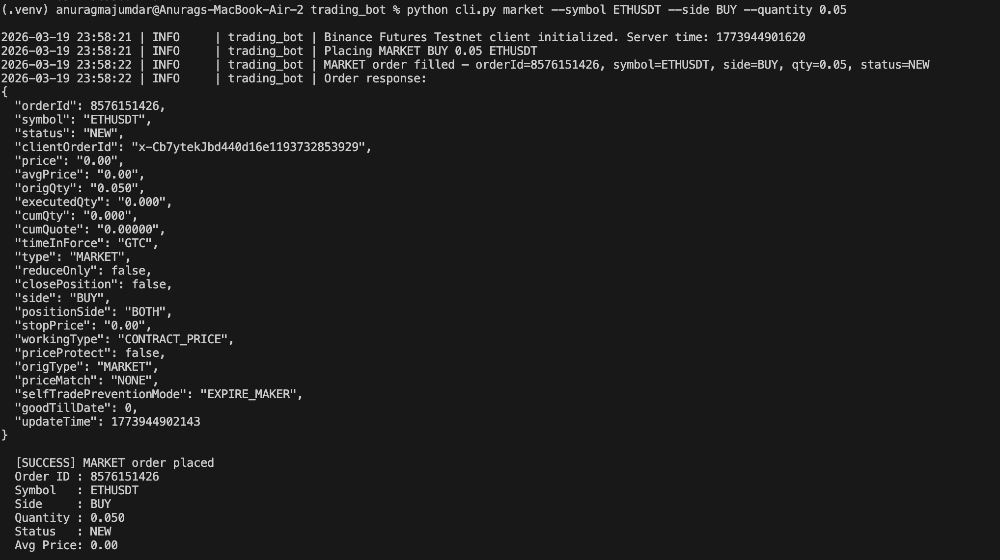
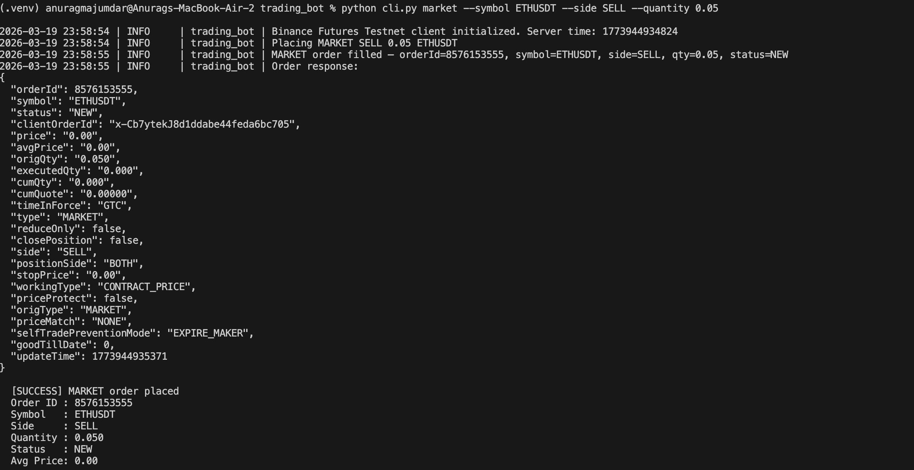
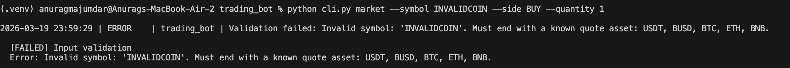
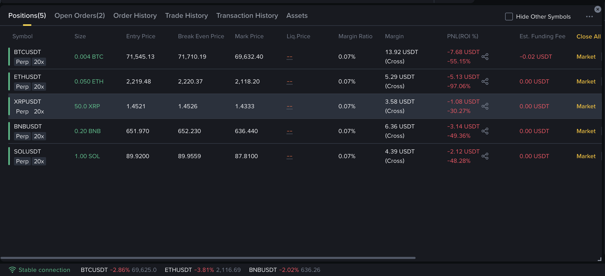

# Binance Futures Testnet Trading Bot

A production-quality CLI trading bot for placing **MARKET**, **LIMIT**, and **STOP-LIMIT** orders on the Binance Futures Testnet (USDT-M). Built with Python and the `python-binance` library.

> **This bot connects exclusively to the Binance Futures Testnet. No real funds are ever at risk.**

---

## Features

- **MARKET orders** — execute immediately at the current market price
- **LIMIT orders** — place at a specific price with GTC (Good Till Cancelled) time-in-force
- **STOP-LIMIT orders** — conditional orders that trigger at a stop price and execute at a limit price (for stop-losses and breakout entries)
- **BUY and SELL** support for all order types
- **Input validation** — symbol format, quote asset suffix, quantity/price/stop-price parsing via `Decimal`
- **Automatic retry** — transient network failures retry up to 3 times with exponential backoff
- **Rotating file logs** — all activity logged with timestamps and severity levels
- **Structured CLI output** — clear success/failure messages in the terminal
- **No hardcoded secrets** — API keys loaded from a `.env` file

---

## Project Structure

```
trading_bot/
├── bot/
│   ├── __init__.py          # Package exports
│   ├── client.py            # Binance Futures Testnet client initialization
│   ├── orders.py            # Order placement logic with retry
│   ├── validators.py        # Input validation and decimal normalization
│   └── logging_config.py    # Rotating file + console logger setup
├── cli.py                   # CLI entry point (argparse)
├── requirements.txt         # Python dependencies
├── .env                     # API keys (you create this — not committed)
├── .gitignore               # Excludes .env, logs, __pycache__, .venv
└── logs/
    └── trading_bot.log      # Auto-created at first run
```

---

## Setup Instructions

### 1. Get Binance Futures Testnet API Keys

1. Go to **https://testnet.binancefuture.com**
2. Click **Log In** and authenticate with your GitHub account
3. Once logged in, navigate to **API Key** in the bottom-left sidebar
4. You will see your **API Key** and **Secret Key** — copy both

> These are testnet-only credentials. They do not work on the real Binance exchange.

### 2. Clone or Navigate to the Project

```bash
cd trading_bot
```

### 3. Create a Virtual Environment

```bash
python3 -m venv .venv
source .venv/bin/activate        # macOS / Linux
# .venv\Scripts\activate         # Windows
```

### 4. Install Dependencies

```bash
pip install -r requirements.txt
```

### 5. Create the `.env` File

Create a file named `.env` in the `trading_bot/` root directory:

```
BINANCE_API_KEY=your_api_key_here
BINANCE_API_SECRET=your_secret_key_here
```

Replace the placeholder values with the keys from Step 1.

> **Do not commit `.env` to version control.** It is already in `.gitignore`.

---

## Usage

All commands are run from the `trading_bot/` directory with the virtual environment activated.

### Place a MARKET Order

```bash
python cli.py market --symbol BTCUSDT --side BUY --quantity 0.002
```

### Place a LIMIT Order

```bash
python cli.py limit --symbol ETHUSDT --side SELL --quantity 0.05 --price 3500.00
```

### Place a STOP-LIMIT Order

A stop-limit order activates when the market reaches the **stop price**, then places a limit order at the **limit price**.

```bash
# Stop-loss: if BTC drops to 78000, sell at 77500
python cli.py stop-limit --symbol BTCUSDT --side SELL --quantity 0.002 --stop-price 78000 --price 77500

# Breakout buy: if BTC rises to 90000, buy at 90500
python cli.py stop-limit --symbol BTCUSDT --side BUY --quantity 0.002 --stop-price 90000 --price 90500
```

> **Important:** The stop price must not cause an immediate trigger. For SELL stop-limits, set `--stop-price` **below** the current market price. For BUY stop-limits, set it **above** the current price. Otherwise Binance returns error `-2021: Order would immediately trigger`.

### CLI Help

```bash
python cli.py --help
python cli.py market --help
python cli.py limit --help
python cli.py stop-limit --help
```

### Argument Reference

| Argument       | Required                | Description                                |
|---------------|-------------------------|--------------------------------------------|
| `--symbol`    | Yes                     | Trading pair (e.g. `BTCUSDT`)              |
| `--side`      | Yes                     | `BUY` or `SELL`                            |
| `--quantity`  | Yes                     | Order quantity (e.g. `0.002`)              |
| `--price`     | LIMIT & STOP-LIMIT only | Limit price (e.g. `65000.00`)              |
| `--stop-price`| STOP-LIMIT only         | Trigger price (e.g. `78000.00`)            |

> **Minimum notional:** Every order must have quantity × price ≥ $100. For MARKET orders, this is quantity × current market price.

---

## Sample Output

### Successful MARKET Order

```
2026-03-18 20:59:09 | INFO     | trading_bot | Binance Futures Testnet client initialized. Server time: 1773847749241
2026-03-18 20:59:09 | INFO     | trading_bot | Placing MARKET BUY 0.002 BTCUSDT
2026-03-18 20:59:09 | INFO     | trading_bot | MARKET order filled — orderId=12863255495, symbol=BTCUSDT, side=BUY, qty=0.002, status=NEW

  [SUCCESS] MARKET order placed
  Order ID : 12863255495
  Symbol   : BTCUSDT
  Side     : BUY
  Quantity : 0.002
  Status   : NEW
```

### Successful STOP-LIMIT Order

```
2026-03-19 15:03:52 | INFO     | trading_bot | Placing STOP_LIMIT BUY 0.002 BTCUSDT @ 90500 (trigger: 90000)

  [SUCCESS] STOP_LIMIT order placed
  Order ID : 1000000029422139
  Symbol   : BTCUSDT
  Side     : BUY
  Quantity : 0.002
  Status   : NEW
  Price    : 90500.00
  Stop Price: 90000.00
```

### Successful STOP-LIMIT Order (Full Terminal Output)

```
(.venv) anuragmajumdar@Anurags-MacBook-Air-2 trading_bot % python cli.py stop-limit --symbol BTCUSDT --side BUY --quantity 0.002 --stop-price 90000 --price 90500
2026-03-19 15:04:52 | INFO     | trading_bot | Binance Futures Testnet client initialized. Server time: 1773912892477
2026-03-19 15:04:52 | INFO     | trading_bot | Placing STOP_LIMIT BUY 0.002 BTCUSDT @ 90500 (trigger: 90000)
2026-03-19 15:04:52 | INFO     | trading_bot | STOP_LIMIT order accepted — orderId=None, symbol=BTCUSDT, side=BUY, qty=0.002, price=90500, stopPrice=90000, status=None
2026-03-19 15:04:52 | INFO     | trading_bot | Order response:
{
  "algoId": 1000000029422547,
  "clientAlgoId": "x-Cb7ytekJ391581aecff016af49a0a8",
  "algoType": "CONDITIONAL",
  "orderType": "STOP",
  "symbol": "BTCUSDT",
  "side": "BUY",
  "positionSide": "BOTH",
  "timeInForce": "GTC",
  "quantity": "0.002",
  "algoStatus": "NEW",
  "triggerPrice": "90000.00",
  "price": "90500.00",
  ...
}

  [SUCCESS] STOP_LIMIT order placed
  Order ID : 1000000029422547
  Symbol   : BTCUSDT
  Side     : BUY
  Quantity : 0.002
  Status   : NEW
  Price    : 90500.00
  Stop Price: 90000.00
```

### MARKET BUY — ETHUSDT (Screenshot)



### MARKET SELL — ETHUSDT (Screenshot)



### Failed Validation — Invalid Symbol (Screenshot)



### Live Positions on Binance Futures Testnet (Screenshot)

All positions opened via the bot, visible on the testnet web UI under **Positions**:



### Failed Validation

```
  [FAILED] Input validation
  Error: Invalid symbol: 'BTCXYZ'. Must end with a known quote asset: USDT, BUSD, BTC, ETH, BNB.
```

### Failed Order (API Error)

```
  [FAILED] Order placement
  Error: Binance API error: [-2021] Order would immediately trigger.
```

---

## Logging

- **Log file**: `logs/trading_bot.log`
- **Rotation**: 5 MB per file, 3 backup files retained
- **Format**: `YYYY-MM-DD HH:MM:SS | LEVEL | trading_bot | message`
- **Console**: INFO and above printed to stdout
- **File**: DEBUG and above written to log file
- The `logs/` directory is created automatically on first run

---

## Assumptions

1. **Testnet only** — the bot is hardcoded to use `https://testnet.binancefuture.com`. It will never connect to the live Binance API.
2. **USDT-M Futures** — designed for USDT-margined futures contracts (e.g. `BTCUSDT`, `ETHUSDT`).
3. **GTC time-in-force** — LIMIT and STOP-LIMIT orders use Good Till Cancelled. They remain open until filled or manually cancelled.
4. **No leverage management** — the bot places orders using whatever leverage is currently set on your testnet account (default 20x). Adjust leverage via the testnet web UI.
5. **Symbol validation** — accepted quote assets are `USDT`, `BUSD`, `BTC`, `ETH`, and `BNB`.
6. **Python 3.10+** — uses `str | None` union syntax in type hints.
7. **Single orders** — the bot places one order per CLI invocation. It is not a continuously running strategy bot.
8. **Minimum notional** — Binance requires each order's notional value (quantity × price) to be at least $100.
